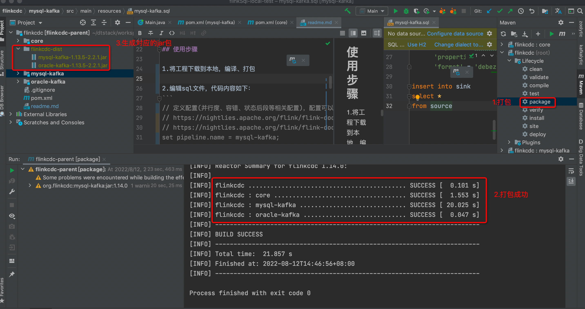

# 基于apache flink和flink-cdc-connectors工程的采集案例

该工程的目的是可以通过sql化的方式，方便的全量、增量一体化采集mysql、oracle等数据库中的数据，而不用安装其他的一些类canal、ogg等采集工具.
由于目前数栈flink版本(version:flink1.12.7)原因，该工程打包后，不可在数栈上使用.

## 支持的数据库
### source端配置和数据类型
| Connector                                                 | Database                                                                                                                                                                                                                                                                                                                                                                                               | Driver                  |
|-----------------------------------------------------------|--------------------------------------------------------------------------------------------------------------------------------------------------------------------------------------------------------------------------------------------------------------------------------------------------------------------------------------------------------------------------------------------------------|-------------------------|
| [mysql-cdc](https://github.com/ververica/flink-cdc-connectors/blob/release-2.2/docs/content/connectors/mysql-cdc.md)         | <li> [MySQL](https://dev.mysql.com/doc): 5.6, 5.7, 8.0.x <li> [RDS MySQL](https://www.aliyun.com/product/rds/mysql): 5.6, 5.7, 8.0.x <li> [PolarDB MySQL](https://www.aliyun.com/product/polardb): 5.6, 5.7, 8.0.x <li> [Aurora MySQL](https://aws.amazon.com/cn/rds/aurora): 5.6, 5.7, 8.0.x <li> [MariaDB](https://mariadb.org): 10.x <li> [PolarDB X](https://github.com/ApsaraDB/galaxysql): 2.0.1 | JDBC Driver: 8.0.21     |
| [oracle-cdc](https://github.com/ververica/flink-cdc-connectors/blob/release-2.2/docs/content/connectors/oracle-cdc.md)       | <li> [Oracle](https://www.oracle.com/index.html): 11, 12, 19                                                                                                                                                                                                                                                                                                                                           | Oracle Driver: 19.3.0.0 |
| [sqlserver-cdc](https://github.com/ververica/flink-cdc-connectors/blob/release-2.2/docs/content/connectors/sqlserver-cdc.md)       | <li> [Sqlserver](https://www.microsoft.com/sql-server): 2012, 2014, 2016, 2017, 2019                                                                                                                                                                                                                                                                                                             | JDBC Driver: 7.2.2.jre8 |

### sink端配置和数据类型(目前只支持写kafka)
| Connector                                                 | Format                                                                                                                                                                                                                                                                                                                                                                                               | Data                  |
|-----------------------------------------------------------|--------------------------------------------------------------------------------------------------------------------------------------------------------------------------------------------------------------------------------------------------------------------------------------------------------------------------------------------------------------------------------------------------------|-------------------------|
| kafka        |[debezium-json](https://nightlies.apache.org/flink/flink-docs-master/docs/connectors/table/formats/debezium/) |  [debezium-json 数据格式](https://nightlies.apache.org/flink/flink-docs-master/docs/connectors/table/formats/debezium/#how-to-use-debezium-format) |
| kafka        |[canal-json](https://nightlies.apache.org/flink/flink-docs-master/docs/connectors/table/formats/canal/) | [canal-json 数据格式](https://nightlies.apache.org/flink/flink-docs-master/docs/connectors/table/formats/canal/#how-to-use-canal-format) |
| kafka        |[maxwell-json](https://nightlies.apache.org/flink/flink-docs-master/docs/connectors/table/formats/maxwell/) |  [maxwell-json 数据格式](https://nightlies.apache.org/flink/flink-docs-master/docs/connectors/table/formats/maxwell/#how-to-use-maxwell-format)|
| kafka        |[changelog-json](https://ververica.github.io/flink-cdc-connectors/release-2.1/content/formats/changelog-json.html) | changelog-json 数据格式：<br> {"data":{},"op":"+I"} <br> {"data":{},"op":"-U"} <br> {"data":{},"op":"+U"} <br> {"data":{},"op":"-D"} |
| kafka        |[ogg-json](https://nightlies.apache.org/flink/flink-docs-master/docs/connectors/table/formats/ogg/) | [ogg-json 数据格式](https://nightlies.apache.org/flink/flink-docs-master/docs/connectors/table/formats/ogg/#how-to-use-ogg-format) |

## 使用步骤

1.将工程下载到本地，编译、打包


2.编辑sql文件，代码内容如下：
```
-- 定义配置(并行度、容错、状态后段等相关配置)，配置可以参考下面链接：
-- https://nightlies.apache.org/flink/flink-docs-master/docs/dev/table/config/
-- https://nightlies.apache.org/flink/flink-docs-master/docs/deployment/config/
set pipeline.name = mysql-kafka;
set table.exec.resource.default-parallelism = 1;

-- source端配置和数据类型 参考上面
CREATE TABLE source
(
    id   INT,
    name STRING,
    PRIMARY KEY (id) NOT ENFORCED
) WITH (
      'connector' = 'mysql-cdc',
      'hostname' = 'localhost',
      'port' = '3306',
      'username' = 'root',
      'password' = 'root',
      'database-name' = 'test',
      'table-name' = 'out_cdc');

-- sink端配置和数据类型 参考上面
CREATE TABLE sink
(
    id   INT,
    name STRING
) WITH (
      'connector' = 'kafka',
      'topic' = 'chuixue',
      'properties.bootstrap.servers' = 'localhost:9092',
      'format' = 'debezium-json');

-- 执行sql
insert into sink
select *
from source
``` 
3.在服务器上执行 
找到需要采集的数据源和目的，比如采集mysql到kafka，这选择mysql-kafka-1.13.5-2.2.1.jar运行，执行如下命令即可
```
java -cp mysql-kafka-1.13.5-2.2.1.jar org.flinkcdc.core.Main sql文件的路径
```

## 后续计划
1.支持更多数据库采集